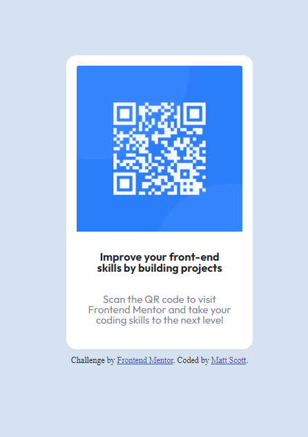

# Frontend Mentor - QR code component solution

This is a solution to the [QR code component challenge on Frontend Mentor](https://www.frontendmentor.io/challenges/qr-code-component-iux_sIO_H). Frontend Mentor challenges help you improve your coding skills by building realistic projects.

## Table of contents

- [Overview](#overview)
  - [Screenshot](#screenshot)
  - [Links](#links)
- [My process](#my-process)
  - [Built with](#built-with)
  - [What I learned](#what-i-learned)
  - [Continued development](#continued-development)
  - [Useful resources](#useful-resources)
- [Author](#author)
- [Acknowledgments](#acknowledgments)

**Note: Delete this note and update the table of contents based on what sections you keep.**

## Overview

Display a QR Code in a card-like appearance.  

### Screenshot

### Links

- Solution URL: [https://github.com/brewaskew/qr-code](https://github.com/brewaskew/qr-code)
- Live Site URL: [https://brewaskew.github.io/qr-code/](https://brewaskew.github.io/qr-code/)

## My process

I completed this project using HTML, CSS, and Bootstrap.  I was able to get the basic layout completed, but ran into issues trying to get the cards container to vertically center in the display.  After a lot of trial and error and searching for vertical aligning tutorials, I ultimately got help by looking at Max Kaiser's solution.  Still after a little bit more trial and error I was ultimately able to complete the project.

### Built with

- HTML
-CSS
-Bootstrap

### What I learned

I gained a better understanding of CSS/Bootstrap display options and how they effect the page.

To see how you can add code snippets, see below:

### Continued development

I still have a ways to go in fully understanding how all the display options effect the page.  I hope to gain that knowledge with more projects, as well as streamlining/simplifying my code.

### Useful resources

- [Resource 1](https://github.com/maxkaiser100/qrcode) - Max's code really helped me to figure out vertically centering my qr code "box."

## Author

- Frontend Mentor - [@brewaskew](https://www.frontendmentor.io/profile/brewaskew)
- Twitter - [@brewaskew](https://www.twitter.com/brewaskew)
- LinkedIn - [@mscott0](https://www.linkedin.com/in/mscott0/)

## Acknowledgments

Thank you to Max Kaiser (github: maxkaiser100).  I found your solution on frontendmentor.io and it definitely pointed me in the right direction.
